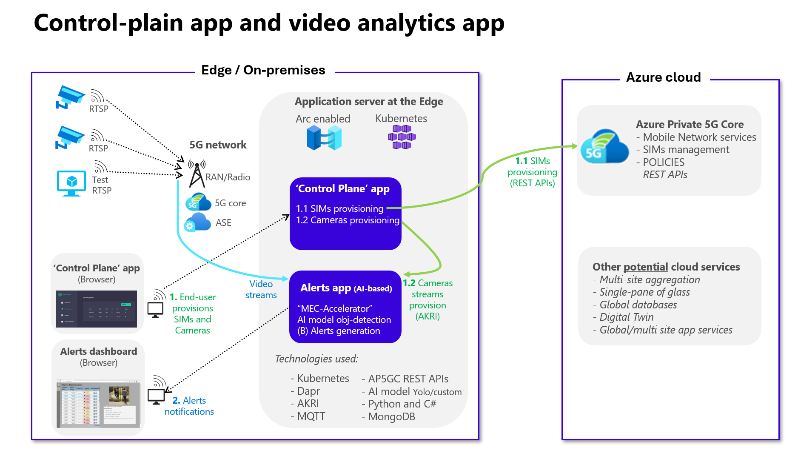
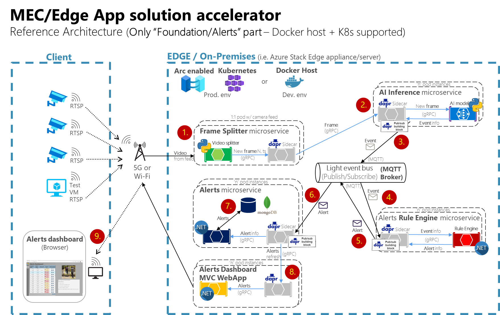
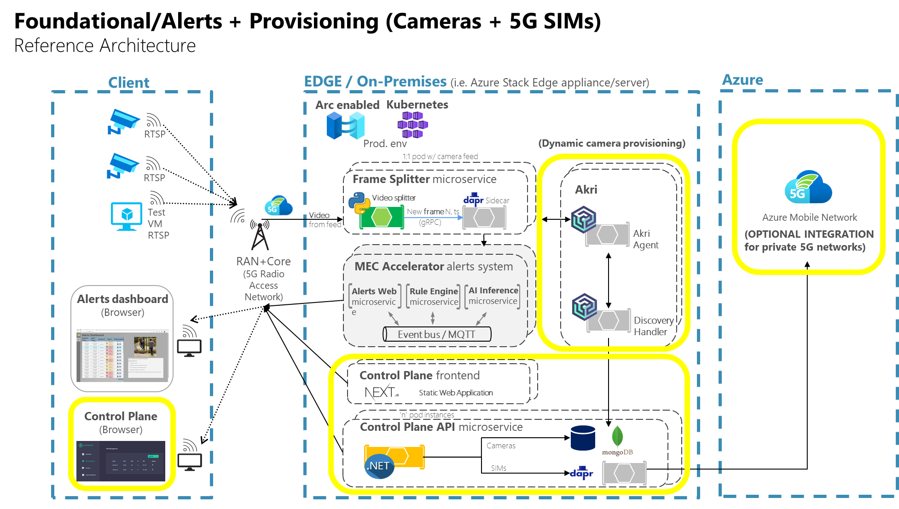

## Create live video analytics at the edge/MEC using Azure IoT Operations (AIO)

Contoso Energy, a fictional company, requires a live video analytics at the edge (in its plants) with alerts dashboards and dynamic provisioning of any number of IP video cameras at the MEC (Multi-access Edge Compute through 5G, Wi-Fi or Ethernet) to provide real-time alerts on issues detected by AI models analyzing the video streams.

In Private MEC (Multi-access Edge Compute) covering large outdoor/indor industrial areas, the best fit is to use private 5G networks and 5G video cameras. However, in other use cases Wi-Fi or Ethernet cameras can also be used. 

## Goals of this MEC app solutio accelerator (Example application)

As mentioned, the network needs are provided by the infrastructure such as a 5G network or Wi-Fi and eEdge compute. However, aspects such as being able to create and event-driven application (Devices-->AI-->Events-->Logic-->Alerts-->Handlers) need to be implemented by your application and it's precisely the value that this example application provides:

- Recommendations on using event-driven and microservices architecture explained by this example implementation.
- Showcase of design patterns to implement (Event Pub/Sub, microservices autonomy, extensible events/alerts metadata schemas, etc.).
- Show how to inference with deep-learning models from a microservice, in this case using 'Yolo', for video/image analytics, then generate the related detection event.

## High level modules architecture

The solution for Contoso involves the following modules:

- A control-plane application in charge of:
  - Dynamically provision video cameras (n cameras).
  - (Optional) Dynamically provision related 5G SIMs in Azure Private 5G Core.

- A video analytics and event-driven alerts system in charge of:
  - Scalable video stream ingestion (n streams).
  - Scalable object/issue detection based on an AI model.
  - Alert rules engine to determine if an event should be really an alert.
  - Alerts dashboard UI.

  Below you can see a high-level diagram with the above modules and interaction:





## Internal software architecture

This reference application proposes an event-driven and microservice oriented architecture implementation with multiple autonomous microservices. 

The main goal is to ingress data from client IoT/edge devices. The initial functionality for this sample application is to ingress video from wireless cameras, analyze it with AI models, detect issues, create events and submit them to a messaging broker thorugh a Publish/Subscription approach so additional microservices evaluate if the events need to be converted to Alerts and publish the alerts to the multiple event handlers related, such as an "Alerts dashboard" app or any other integrated process that needs to react in real-time thanks to the low latency provided by the Edge.

### The 'Alerts application' software architecture

Not taking into account the dynamic provisioning of 'n' number of cameras, the below architecture diagram exposes the implemented microservices to tackle the video analytics system:

Note that given that this "core" application is just about processing the video without the dynamic provisioning feature, it can be deployed into the following environments:

- Docker host (docker compose)
- Kubernetes/K3s



However, this is not just about 'Video analytics'. The important value of this architecture and reference applications is based on the event-driven architecture which can be very easily customized to support different types of "input data" from IoT devices, so instead of video, it coud ingress data from IoT sensors, or manufacturing machines, analyze it with different type of AI models in the same MEC's network and again generate comparable events and derived alerts with a very low latency.

Therefore, the importance of this example applications is about the event-driven design patterns implemented by using light MQTT messaging brokers and effective dedicated microservices leveraging DAPR (Microsoft's framework specialized on microservices patters) and deployed on Kubernetes so the solution can be deployed on most EDGE environments supporting Kubernetes.

### The 'Control-plane application' software architecture

The 'Control-plane application' extends the 'Alerts Application' or 'core application' by supporting dynamic provisioning of "n" number of video cameras and optionally "n" number of 5G SIMs, if using a private 5G network.

The video stream processing requires one pod/container per each camera/stream. Therefore, if you add 10 cameras, you would need 10 pods/containers processing the video stream. But how can we implement that growth dynamically?

This "dynamic provisioning" of video cameras is implemented thanks to AKRI, a component provided by Azure IoT Operations, which allows to dynamically grow the video ingestion and AI models, as shown in the below software architecture diagram:




###########################

DEPLOYMENT LINKS to "double-click" deployment level.


###########################


- A Kubernetes cluster on the edge using [AKS Edge Essentials](https://learn.microsoft.com/azure/aks/hybrid/aks-edge-overview), managed by Azure Arc, which hosts various [Azure IoT Operations](https://learn.microsoft.com/azure/iot-operations/get-started/overview-iot-operations) services.
- A custom-developed MQTT-Simulator that mimics plant and fryer data, transmitting it to Azure IoT MQ via MQTT.
- An MQTT-listener service that captures this production line data, sending it to an open source [InfluxDb](https://www.influxdata.com/) on the edge, generating near real-time dashboards and analytics and visualizes it using [Grafana](https://Grafana.com/).
- An Azure IoT MQ connection with [Azure Event Grid namespace](https://learn.microsoft.com/azure/event-grid/create-view-manage-namespaces), an MQTT broker integrated into Azure, pushing data to Azure Event Grid and subsequently to [Azure Data Explorer](https://learn.microsoft.com/azure/data-explorer/).
- Azure Data Explorer dashboards and analytics for supervisory and executive roles monitoring multiple plants' operations.

> **Note:** Currently, Azure IoT Operations is in preview.


The following Jumpstart scenario will show how to create an AKS Edge Essentials cluster in Azure Windows Server VM and connect the Azure VM and AKS Edge Essentials cluster to Azure Arc using [Azure Bicep](https://learn.microsoft.com/azure/azure-resource-manager/bicep/overview). The provided Bicep template is responsible for creating the Azure resources as well as executing the LogonScript including AKS Edge Essentials cluster creation, AIO deployment, Azure resource deployment, and Azure Arc onboarding (Azure VM and AKS Edge Essentials cluster) on the Azure VM.

> **Note:** It is not expected to use a nested virtualization in a production environment, let alone using an Azure VM to do so. The below scenario is unsupported and should ONLY be used for demo and testing purposes.

## Prerequisites

- [Install or update Azure CLI to version 2.49.0 or above](https://docs.microsoft.com/cli/azure/install-azure-cli?view=azure-cli-latest). Use the following command to check your current installed version.

    ```shell
    az --version
    ```

- Login to Azure CLI using the *`az login`* command.

- Ensure that you have selected the correct subscription you want to deploy AIO to by using the *`az account list --query "[?isDefault]"`* command. If you need to adjust the active subscription used by Az CLI, follow [this guidance](https://learn.microsoft.com/cli/azure/manage-azure-subscriptions-azure-cli#change-the-active-subscription).

- AIO must be deployed to one of the following regions. **Deploying AIO outside of these regions may result in unexpected results or deployment errors.**

  - East US 2
  - West US 2
  - North Europe
  - West Europe

- **AIO requires 8 Ds-series vCPUs**. Ensure you have sufficient vCPU quota available in your Azure subscription and the region where you plan to deploy AIO. You can use the below Az CLI command to check your vCPU utilization.

  ```shell
  az vm list-usage --location <your location> --output table
  ```

  

- **AIO requires 1 Public IP address**. Ensure you have sufficient public IP addresses available in your Azure subscription and the region where you plan to deploy AIO.

- Register necessary Azure resource providers by running the following commands.

  ```shell
  az provider register --namespace Microsoft.Kusto --wait
  az provider register --namespace Microsoft.EventGrid --wait
  az provider register --namespace Microsoft.EventHub --wait
  az provider register --namespace Microsoft.KeyVault --wait
  az provider register --namespace Microsoft.Storage --wait
  ```

- Create Azure service principal (SP). An Azure service principal assigned with the *Owner* Role-based access control (RBAC) role is required. You can use Azure Cloud Shell (or other Bash shell), or PowerShell to create the service principal.

  - (Option 1) Create service principal using [Azure Cloud Shell](https://shell.azure.com/) or Bash shell with Azure CLI:

    ```shell
    az login
    subscriptionId=$(az account show --query id --output tsv)
    az ad sp create-for-rbac -n "<Unique SP Name>" --role "Owner" --scopes /subscriptions/$subscriptionId
    ```

    For example:

    ```shell
    az login
    subscriptionId=$(az account show --query id --output tsv)
    az ad sp create-for-rbac -n "JumpstartAIOSP" --role "Owner" --scopes /subscriptions/$subscriptionId
    ```

    Output should look similar to this:

    ```json
    {
    "appId": "XXXXXXXXXXXXXXXXXXXXXXXXXXXX",
    "displayName": "JumpstartAIOSP",
    "password": "XXXXXXXXXXXXXXXXXXXXXXXXXXXX",
    "tenant": "XXXXXXXXXXXXXXXXXXXXXXXXXXXX"
    }
    ```

    To get the service principal object id, you can run the following command

    ```shell
    az ad sp list --display-name "<Unique SP Name>" --query "[].{Name:displayName, ObjectId:id}"
    ```

  - (Option 2) Create service principal using PowerShell. If necessary, follow [this documentation](https://learn.microsoft.com/powershell/azure/install-az-ps?view=azps-8.3.0) to install or update Azure PowerShell to version 10.4.0 or above.

    ```powershell
    $account = Connect-AzAccount
    $spn = New-AzADServicePrincipal -DisplayName "<Unique SPN name>" -Role "Owner" -Scope "/subscriptions/$($account.Context.Subscription.Id)"
    echo "SPN App id: $($spn.AppId)"
    echo "SPN secret: $($spn.PasswordCredentials.SecretText)"
    echo "SPN tenant: $($account.Context.Tenant.Id)"
    echo "SPN object id: $($spn.Id)"
    ```

    For example:

    ```powershell
    $account = Connect-AzAccount
    $spn = New-AzADServicePrincipal -DisplayName "JumpstartAIOSP" -Role "Owner" -Scope "/subscriptions/$($account.Context.Subscription.Id)"
    echo "SPN App id: $($spn.AppId)"
    echo "SPN secret: $($spn.PasswordCredentials.SecretText)"
    echo "SPN object id: $($spn.Id)"
    ```

    Output should look similar to this:

    

    > **Note:** If you create multiple subsequent role assignments on the same service principal, your client secret (password) will be destroyed and recreated each time. Therefore, make sure you grab the correct secret

    > **Note:** The Jumpstart scenarios are designed with as much ease of use in mind and adhering to security-related best practices whenever possible. It is optional but highly recommended to scope the service principal to a specific [Azure subscription and resource group](https://learn.microsoft.com/cli/azure/ad/sp?view=azure-cli-latest) as well as considering using a [less privileged service principal account](https://learn.microsoft.com/azure/role-based-access-control/best-practices).

- AIO requires creating a "user_impersonation" delegated permission on Azure Key Vault for this service principal.

  - Navigate to *Microsoft Entra Id* (previously known as Azure Active Directory) in the Azure portal.

    

  - Click on "App registrations" and search for the name of the service principal you created.

    

  - Click on "API permissions" and add a new permission.

    

  - Select "Azure Key Vault".

    

  - Click on "Delegated permissions" and select the "user_impersonation" permission.

    

    

## Deployment via Azure Developer CLI

- Follow the install guide for the [Azure Developer CLI](https://learn.microsoft.com/azure/developer/azure-developer-cli/install-azd?tabs=winget-windows%2Cbrew-mac%2Cscript-linux&pivots=os-linux) for your environment.

  > **Note:** PowerShell is required for using azd with Jumpstart AIO. If you are running in a Linux environment be sure that you have [PowerShell for Linux](https://learn.microsoft.com/powershell/scripting/install/installing-powershell-on-linux?view=powershell-7.3) installed.

- Run *`Connect-AzAccount`* which will open a prompt for interactive login for Azure PowerShell.

  

- Login with azd using *`azd auth login`* which will open a browser for a similar interactive login for Azure Developer CLI.

- Run the *`azd init`* command from your cloned repo *azure_arc_jumpstart/azure_edge_iot_ops_jumpstart/aio_manufacturing* folder.

  

- Run the *`azd up`* command to deploy the environment. Azd will prompt you to enter the target subscription, region and all required parameters.

  

## Deployment: Bicep deployment via Azure CLI

- Upgrade to latest Bicep version

  ```shell
  az bicep upgrade
  ```

- Edit the [main.parameters.json](https://github.com/microsoft/azure_arc/blob/main/azure_edge_iot_ops_jumpstart/aio_manufacturing/bicep/main.parameters.json) template parameters file and supply some values for your environment.
  - *`spnClientId`* - Your Azure service principal application id
  - *`spnObjectId`* Your Azure service principal object id
  - *`spnClientSecret`* - Your Azure service principal secret
  - *`spnTenantId`* - Your Azure tenant id
  - *`windowsAdminUsername`* - Client Windows VM Administrator username
  - *`windowsAdminPassword`* - Client Windows VM Password. Password must have 3 of the following: 1 lower case character, 1 upper case character, 1 number, and 1 special character. The value must be between 12 and 123 characters long.
  - *`deployBastion`* - Option to deploy using Azure Bastion instead of traditional RDP. Set to true or false.

  

- You will need to get the Azure Custom Location Resource Provider (RP) Object ID (OID) and export it as an environment variable. This is required to enable [Custom Location](https://learn.microsoft.com/azure/azure-arc/platform/conceptual-custom-locations) on your cluster.

> **Note:** You need permissions to list all the service principals.

### Option 1: Bash

  ```shell
  customLocationRPOID=$(az ad sp list --filter "displayname eq 'Custom Locations RP'" --query "[?appDisplayName=='Custom Locations RP'].id" -o tsv)
  ```

### Option 2: PowerShell

  ```powershell
  $customLocationRPOID=(az ad sp list --filter "displayname eq 'Custom Locations RP'" --query "[?appDisplayName=='Custom Locations RP'].id" -o tsv)
  ```

- Now you will deploy the Bicep file. Navigate to the local cloned [deployment folder](https://github.com/microsoft/azure_arc/tree/main/azure_edge_iot_ops_jumpstart/aio_manufacturing/bicep) and run the below command:

  ```shell
  az login
  az group create --name "<resource-group-name>"  --location "<preferred-location>"
  az deployment group create -g "<resource-group-name>" -f "main.bicep" -p "main.parameters.json" -p customLocationRPOID="$customLocationRPOID"
  ```

## Start post-deployment automation

Once your deployment is complete, you can open the Azure portal and see the AIO scenario resources inside your resource group. You will be using the *AIO-Client-VM* Azure virtual machine to explore various capabilities of AIO. You will need to remotely access *AIO-Client-VM*.

  

   > **Note:** For enhanced security posture, RDP (3389) and SSH (22) ports are not open by default in AIO deployments. You will need to create a network security group (NSG) rule to allow network access to port 3389, or use [Azure Bastion](https://learn.microsoft.com/azure/bastion/bastion-overview) or [Just-in-Time (JIT)](https://learn.microsoft.com/azure/defender-for-cloud/just-in-time-access-usage?tabs=jit-config-asc%2Cjit-request-asc) access to connect to the VM

## Connecting to the AIO Client virtual machine

Various options are available to connect to *AIO-Client-VM*, depending on the parameters you supplied during deployment.

- [RDP](#connecting-directly-with-rdp) - available after configuring access to port 3389 on the *AIO-NSG-Prod*, or by enabling [Just-in-Time access (JIT)](#connect-using-just-in-time-access-jit).
- [Azure Bastion](#connect-using-azure-bastion) - available if *`true`* was the value of your *`deployBastion`* parameter during deployment.

### Connecting directly with RDP

By design, port 3389 isn't opened by default on the network security group. Therefore, you must create an NSG rule to allow inbound 3389.

- Open the *AIO-NSG-Prod* resource in Azure portal and click "Add" to add a new rule.

  

  

- Select My IP address from the dropdown.

  

  

  

### Connect using Azure Bastion

- If you have chosen to deploy Azure Bastion in your deployment, use it to connect to the VM.

  

  > **Note:** When using Azure Bastion, the desktop background image is not visible. Therefore some screenshots in this guide may not exactly match your experience if you are connecting to *AIO-Client-VM* with Azure Bastion

### Connect using just-in-time access (JIT)

If you already have [Microsoft Defender for Cloud](https://learn.microsoft.com/azure/defender-for-cloud/just-in-time-access-usage?tabs=jit-config-asc%2Cjit-request-asc) enabled on your subscription and would like to use JIT to access the Client VM, use the following steps:

- In the Client VM configuration pane, enable just-in-time. This will enable the default settings.

  

  

  

## Post deployment

- Once you log into the *AIO-Client-VM*, multiple automated scripts will open and start running. These scripts usually take around thirty minutes to finish, and once completed, the script windows will close automatically. At this point, the deployment is complete.

  

  

  

  

  

  

  

  

  

  

  

  

  

  

  

  

> **Note:** Occassionaly you might get the below error in deploying AIO, this is a known issue. The automation will retry the deployment and proceed

  

  

  

  

  

  

  

  

  

  

- Deployment is complete! Let's begin exploring how Contoso staff can start using the deployed solution.

## Industrial telemetry at the edge

The automation deploys and configures a simulator that simulates data from various bakery equipment, such as ovens, dividers, and mixers, including a dedicated simulation for a fryer unit - a critical asset in the bakery's production line. The MQTT listener captures this data and funnels it to InfluxDB which is optimized for time-series data. 

Grafana, a leading open-source platform for monitoring and observability, taps into InfluxDB to render comprehensive dashboards and analytics, enabling the plant staff at Contoso to monitor and enhance the performance of the strawberry donut production line effectively. Those dashboards provide near real-time information and insights, often projected directly within the production line area, to enable immediate response and decision-making where it matters most.

- Open the MQTT explorer desktop shortcut, it is already configured to connect to the MQTT listener on the cluster.

  

- Once connected, you will start seeing simulated data being transmitted with various metrics from the plant assets.

  

  

  

- To enable the plant staff to monitor and visualize this data in real-time, open the Edge browser, expand InfluxDB in the Favorites Bar, and select *AIO - InfluxDB*.

  

- Login with the Administrator username and password provided when you created the deployment.

  

- Click on dashboards and select the "Contoso Bakery Strawberry Donut production line" dashboard.

  

- Contoso staff can start monitoring the strawberry donut production line. The most critical KPI featured is the Overall Equipment Effectiveness (OEE). The OEE indicator is color-coded for at-a-glance status updates:

  | Color   | Indication                                                        |
  | ------- | ------------------------------------------------------------------ |
  | Green   | 🟩 OEE above the target range of 90% (optimal performance)        |
  | Yellow  | 🟨 OEE between 80% to 90% (acceptable but suboptimal performance) |
  | Red     | 🟥 OEE below 80% (immediate attention needed)                     |


  

- Additionally, the dashboard breaks down the components of OEE; *Availability*, *Product Quality*, and *Performance*, to provide a detailed analysis. A key focus is on *Availability*, with constant monitoring of downtime to identify and classify lost time reasons, such as equipment malfunctions or ingredient shortages.

  

- Users can also view real-time data on the current product being produced, strawberry donuts, as well as the active shift, which in this case is the morning shift.

  

- Critical equipment, such as the fryer, is under special surveillance. The dashboard displays the current oil temperature against the target temperature, along with the oil level in the fryer, ensuring that any deviations from the norm can be quickly addressed.

## Advanced executive dashboards using Azure Data Explorer (ADX)

The automation deploys an ADX cluster and provides a dashboard for Contoso's regional executives and directors who require a broader view across multiple plants. The Azure IoT MQ in the local cluster transmits data to Azure Event Grid, which acts as a cloud-based MQTT broker. It receives operational data and routes it to Azure Event Grid topics, and from there to the Event Hub. Event Hub streamlines the data inflow, allowing ADX to ingest it. Using Kusto Query Language (KQL), Azure Data Explorer provides advanced analytics and custom dashboards that give executives insights into the performance of multiple plants which is crucial for strategic decision-making and long-term planning.

> **Note:** See the diagram in the [Architecture section](#architecture) for more context**

### Manually import dashboards

> **Note:** If you used the [Azure Developer CLI (azd) method](#deployment-via-azure-developer-cli) to deploy the scenario, you may skip this section as these reports are automatically imported for you during the automated deployment

Follow the below steps in order to view the dashboard reports, you will need to import them into ADX.

- On the Client VM, open Windows Explorer and navigate to folder *C:\AIO\adx_dashboard* folder. This folder contains an ADX dashboard report JSON file (*dashboard.json*) with the ADX URI updated when the deployment PowerShell logon script is completed.

  

- Copy this ADX dashboard report JSON file on your local machine in a temporary folder to import into ADX dashboards. Alternatively, you can log in to ADX Dashboards directly on the Client VM.

  > **Note:** Depending on the account being used to log in to the ADX portal, the Azure AD tenant of that account may have conditional access policies enabled to allow access only from corporate-managed devices (for example managed by Microsoft Intune) and might prevent login to ADX Dashboards from the Client VM as this VM is not managed by your organization

- On your local machine open the browser of your choice OR on the Client VM open the Edge browser and log in to [ADX Dashboards](https://dataexplorer.azure.com/). Use the same user account that you deployed the scenario in your subscription. Failure to use the same account will prevent access to the ADX Orders database to generate reports.

- Once you are logged in to ADX dashboards, click on Dashboards in the left navigation to import the dashboard report.

  

- Select "Import dashboard from file" to select previously copied file from the Client VM to your local machine or the *C:\AIO\adx_dashboard* folder on the Client VM.

  

- Choose to import the *dashboard.json* file.

  

- Confirm the dashboard report name, accept the suggested name (or choose your own), and click Create.

  

- It might take a couple of minutes for the dashboard to display some data in the report after deployment. Click Save to save the dashboard report in ADX.

  

- Contoso staff can start leveraging the dashboards, for instance, a regional manager overseeing three plants might use the ADX dashboard to assess the collective OEE of these facilities. The dashboard aggregates essential metrics such as Overall OEE, Performance, and Availability, offering a consolidated view of productivity and efficiency. It highlights the most prevalent current shift's waste reason - in this case, 'Overcooked' and quantifies waste volumes alongside unplanned downtimes and their duration in minutes.

- Furthermore, these stakeholders often engage in comparative analysis. The ADX dashboard enables them to compare the performance across the different shifts operating within a single plant, discerning the OEE for primary products like donuts, bread, and pastries. It also facilitates a comparative review of the OEE across the three plants located in Seattle, Mexico City, and Miami. Quality indicators are also on display, ensuring products meet the required specifications in size and weight.

  

- Critical quality-affecting factors, such as the oil temperature in fryers which can influence the color, size, or doneness of donuts, are also monitored. This level of detail provides executives with the data needed to make informed decisions, ensuring product consistency and operational excellence across the board.

## Cleanup deployment

- To clean up your deployment, simply delete the resource group using Azure CLI or Azure portal.

  ```shell
  az group delete -n <name of your resource group>
  ```

  

  

- If you used Azure Developer CLI to deploy then *`azd down`* can be used instead.

  
